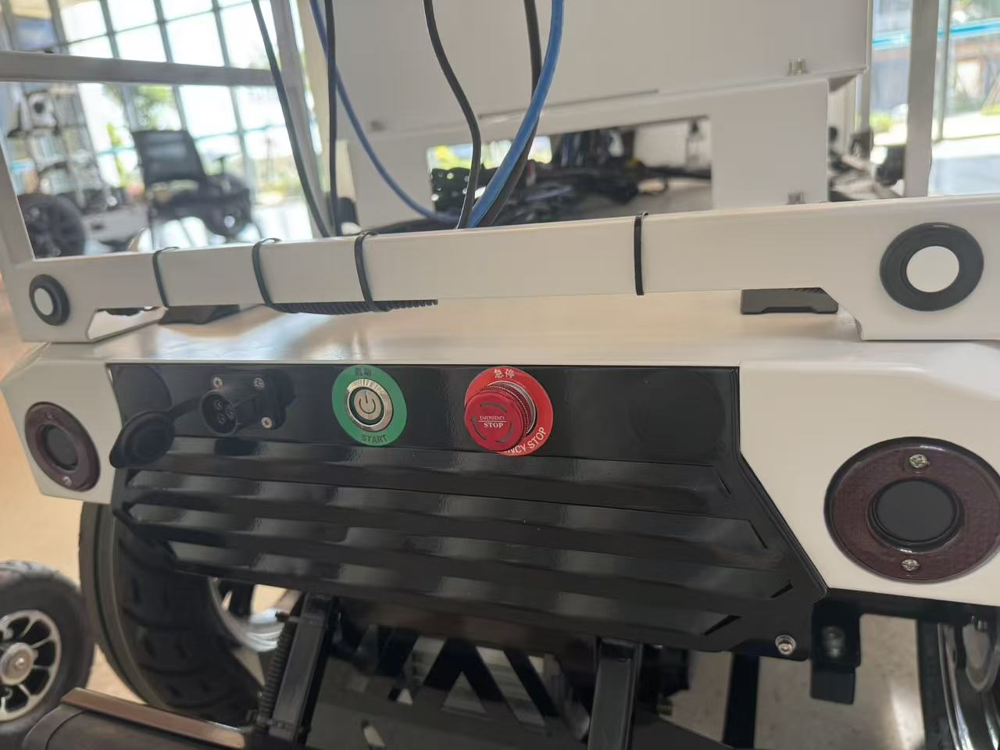

# Week-5 任务书：FR_mid 车辆硬件基础与 Apollo 3.0 架构源码

**课程目标回顾：**
1. 熟悉 FR_mid 硬件集成与物理特性（传感器原理及安全机制）。
2. 理解 Apollo 3.0 软件架构与源码结构，建立模块间的逻辑映射。

---

## 任务 1：FR_mid 车辆核心硬件与紧急制动

### 1. 车辆紧急制动与安全配置

*   **紧急制动按钮位置**：通常位于车体上方或后方明显处。
*   **操作流程**：
    *   **按下**：立即切断车辆底盘动力，进入紧急制动状态。
    *   **解除**：按照按钮表面箭头方向旋转并拉起，系统恢复通电。
*   **防撞条位置**：

    *   **功能说明**：防撞。

### 2. 核心传感器硬件组成及工作原理

#### **(1) 激光雷达 (LiDAR)**
*   **工作原理**：利用主动探测方式，发射特定频率（波长通常为 **905nm** 或 **1550nm**）的近红外激光脉冲。通过测量光束往返的飞行时间（**ToF**）来计算障碍物的距离。
*   **坐标属性**：LiDAR 直接输出的是基于传感器光学中心的**相对位置坐标**（点云数据）。
*   **作用**：
    *   **3D 环境建模**：实时生成海量点云，构建车辆周围的高精度三维模型。
    *   **障碍物检测**：精确识别障碍物的几何尺寸、形状和空间位置。

#### **(2) 组合导航系统 (GNSS/IMU)**
*   **工作原理**：
    *   **GNSS**：接收 GPS/北斗卫星信号，提供全球范围内的**绝对经纬度坐标**。
    *   **IMU**：通过加速度计和陀螺仪测量车辆的线加速度和角速度，推算车身姿态。
    *   **融合算法**：利用**卡尔曼滤波 (Kalman Filter)** 将两者结合。GNSS 修正 IMU 的累积漂移，IMU 在卫星信号弱（如树荫、隧道）时维持高频位置更新。
*   **作用**：解决“我在哪”的问题，为感知数据提供绝对地理参照。

#### **(3) 感知摄像头 (Camera - 双目视觉)**
*   **工作原理**：通过光学透镜成像在 CMOS/CCD 传感器上，将光信号转化为电信号。利用双目相机的**基线视差 (Disparity)** 结合几何三角原理计算深度。
*   **作用**：
    *   **语义识别**：利用深度学习算法识别交通灯颜色、限速牌文字及车道线。
    *   **分类细化**：区分障碍物的具体类别（如：外卖员、宠物、机动车）。

#### **(4) 毫米波雷达 (Millimeter-Wave Radar)**
*   **工作原理**：发射频率在 **30GHz-300GHz** 之间的电磁波。利用**多普勒效应 (Doppler Effect)**，通过反射波与发射波的频率偏移量，直接计算目标物体的**相对速度**。
*   **作用**：
    *   **全天候感知**：不受光照影响，穿透雨、雪、雾的能力极强。
    *   **自适应巡航辅助**：提供精准的动态目标速度跟踪。

#### **(5) 超声波雷达 (Ultrasonic Radar)**
*   **工作原理**：发射超声波脉冲，通过声波在空气中传播的时间差（ToF）计算距离。
*   **作用**：
    *   **近距离防撞**：有效探测距离通常在 **0.15m - 5m**，主要负责车辆侧方和后方的盲区预警。
    *   **泊车辅助**：在低速状态下提供高精度的贴身避障数据。

---

## 任务 2：Apollo 3.0 软件架构及模块功能映射

通过对 `apollo/modules` 源码目录的静态分析，得出以下逻辑架构与代码路径的对应关系：

### Apollo 3.0 核心模块映射表

| 架构层级 | 模块名称 | 核心功能 | 源码路径 (基于 apollo/) |
| :--- | :--- | :--- | :--- |
| **感知定位层** | **Perception** | 障碍物检测、分类、追踪；多传感器融合；交通灯识别。 | `modules/perception` |
| | **Localization** | 结合高精地图与 GNSS/IMU，输出车辆厘米级绝对位姿。 | `modules/localization` |
| | **Map** | 提供 HD Map（高精地图）的数据读取、查询与坐标变换。 | `modules/map` |
| **决策规划层** | **Prediction** | 根据感知到的障碍物轨迹，预测其未来 3-5 秒的运动路径。 | `modules/prediction` |
| | **Routing** | 搜索从起点到终点的全局车道级路由路径。 | `modules/routing` |
| | **Planning** | 在全局路径基础上，考虑避障与交通规则，计算局部行驶轨迹。 | `modules/planning` |
| **执行控制层** | **Control** | 将规划轨迹转换为转向、油门、刹车的具体 PID/MPC 指令。 | `modules/control` |
| | **Canbus** | 与车辆底盘（CAN 总线）通信，下发指令并反馈车身状态。 | `modules/canbus` |
| **安全交互层** | **Guardian** | 安全守护模块。当系统发生严重错误或碰撞风险时触发紧急制动。 | `modules/guardian` |
| | **Monitor** | 实时监控系统硬件运行健康度及各软件模块状态。 | `modules/monitor` |
| | **Dreamview** | 基于 Web 的 HMI 界面，提供车辆状态可视化与调试控制台。 | `modules/dreamview` |

---
